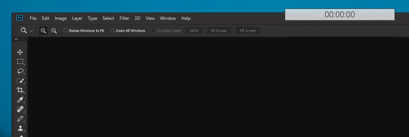

# Photoshop Time Counter
Allows you to track how much time you spend working on files in Photoshop.

It will automatically track currently active file, and will **stop** if **Photoshop is not active** or **user is AFK for 10+ seconds**.

**Double click** removes clicked file from list.

You can "**Pin**" the window to stay always on top.
