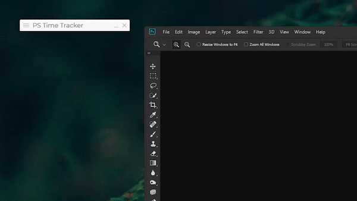

  

  

    <a href="https://github.com/mortuusars/PhotoshopTimeTracker/releases"><a>

# Photoshop Time Tracker
Allows you to track how much time you spend working on files in Photoshop.

- **Delete** key to remove selected items.
- **Right click** on bottom resize border will reset height, and enable auto height.
-  to keep app always on top.

